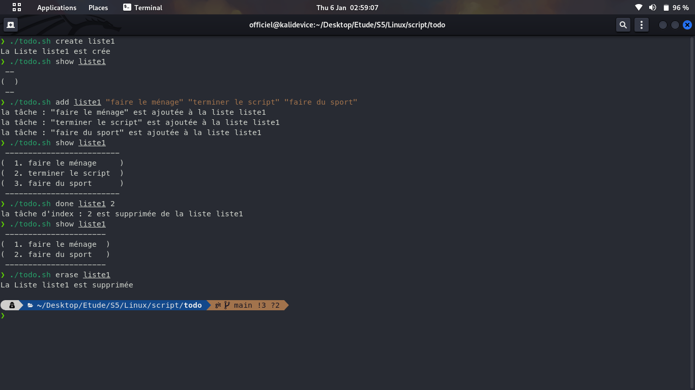

# Todo Bash

A bash script that manages todo lists using lots of functionalities

## Index

- [Todo Bash](#Command-Line-TODO)

  - [Index](#index)
  - [Usage](#usage)
  - [Screenshots](#screenshots)
  - [License](#license)

## Usage

> Use the script in the exact same way.

```Bash
@Usage: ./todo [OPTIONS] [LIST] [INDEX|ITEM]

@OPTIONS:
    -h,help Show help message.
    -c,create Create a new list.
    -a,add Add an item to the list.
    -d,done Remove an item from the list by INDEX number.
    -e,erase Erase list.
    -m,move Move task from list to the end of another list.
    -s,show Display the list.
@LIST:
    Name of list.
@INDEX:
    Integers:Index number of item.
@ITEM:
    String Todo ITEM.
@EXAMPLES:
    ./todo create list5
            Create list under the name list5.
    ./todo -a list5 "Something to do"
            add "Something to do" to list5
    ./todo show list5
            list all the task in the list5.
```

## Screenshots



## License

> Copyright (c) 2022 Elhazzime Salaheddin

> The above copyright notice shall be included in all copies or substantial portions of the Software.
